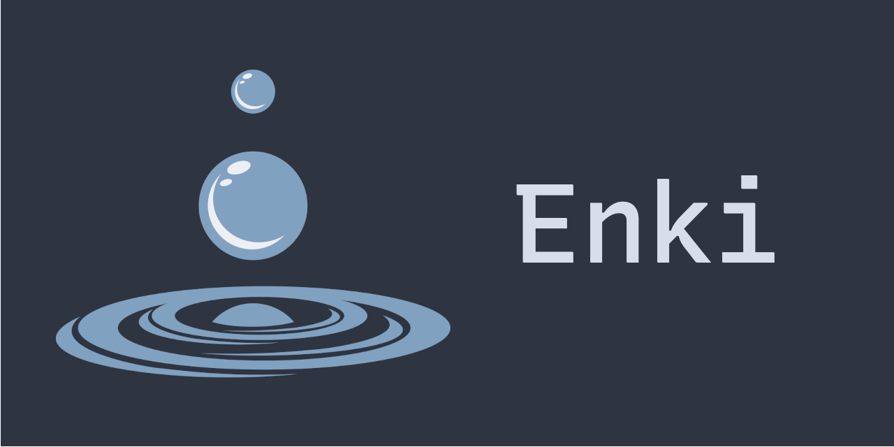

  

  
  
 A REST API that fetches custom data from École 42 users, written in C. 

## Constructed with:
- [Mongoose](https://github.com/cesanta/mongoose)
- [Mjson](https://github.com/cesanta/mjson)
- [Org-mode](https://orgmode.org/manual/index.html)
- [MongoDB Atlas](https://www.mongodb.com/cloud/atlas)
- [Vagrant](https://www.vagrantup.com/)
- [GitHub Actions](https://github.com/features/actions)
- [GitHub Boards](https://docs.github.com/en/issues/organizing-your-work-with-project-boards/managing-project-boards/about-project-boards)
- [Docker](http://docker.io/)
- [Heroku](https://www.heroku.com/)

## How it works:
On an instance, you can send a GET method on the main route to receive a JSON containing curated information about a École 42 student.  
To see all the routes, read the [wiki section](https://github.com/42sp/42labs-selection-process-hde-oliv/wiki/Endpoints) about it.

## How to instantiate it:
You can read the [wiki section](https://github.com/42sp/42labs-selection-process-hde-oliv/wiki/How-to-host-it) on how to instantiate it.

## It is extensible!
You can implement more routes easily, read the [wiki section](https://github.com/42sp/42labs-selection-process-hde-oliv/wiki/How-to-expand-it) for details.

## And you can test it now!
The latest version is already hosted on Heroku, you can access it on: https://enki-api.herokuapp.com/

## For more stuff, read the Wiki!
RTFW!!!

##### Licensed with GPLv3
